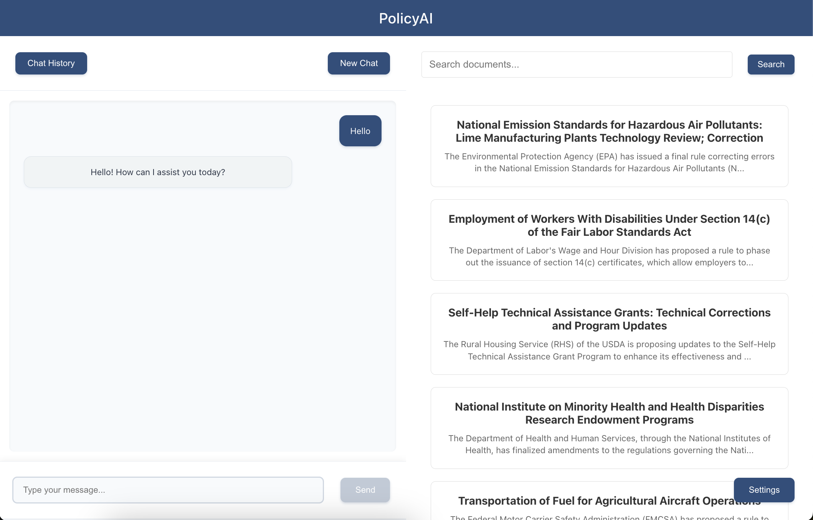

# PolicyAI
### Policy RAG App 

Description:
The project uses a Django backend and React frontend. The Django backend uses Django REST framework to define an API that connects to the RAG system powered by LangChain, which retrieves and processes data to provide responses. LangChain works with a Pinecone vector database to search document chunks for relevance, adding context to responses in addition to custom system prompts and chat history. Chats responses are streamed through websockets. User data, including chat sessions, message histories, and user settings, are stored in PostgreSQL through Django's ORM, while MongoDB stores full documents for the LLM to reference as needed.

To setup:
- Clone this branch for aviary demo
- Create a conda environment in backend/ with conda env create -f environment.yml
- Run python manage.py makemigrations and python manage.py migrate
- Run yarn install in frontend/

To run:
- Start React server in  frontend/ with yarn start, if there are issues run: rm -rf node_modules --> yarn install --> yarn start
- Start Daphne server in backend/ with daphne policybot.asgi:application
- Start redis with redis-server

- To use Django admin: start Django server in backend/ with python manage.py makemigrations --> python manage.py migrate --> python manage.py runserver
- App will run on localhost:3000, Django admin: http://127.0.0.1:8000/admin/

| Component                | Description                                    |
|--------------------------|------------------------------------------------|
| **Django Backend**       | REST API, User Auth, LLM Integration, RAG System|
| **LangChain & ChatGPT**  | Query Processing, Response Generation, Search          |
| **MongoDB & PostgreSQL** | Document Storage, User Data, Conversation History|
| **React Frontend**       | UI Components, State Management, Chat UI       |

