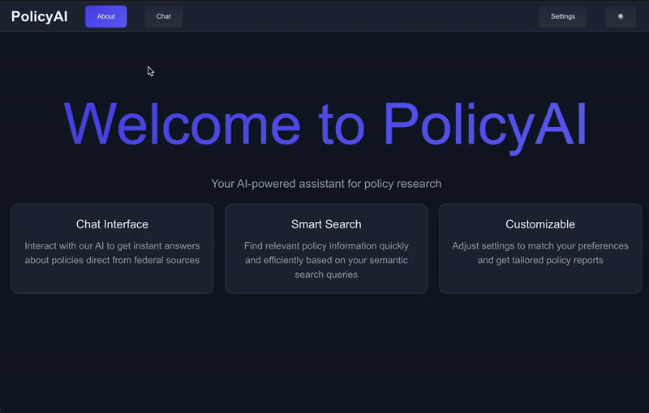

# PolicyAI
### Policy RAG App 

Description:

Agentic RAG app powered by LangGraph

React + CSS frontend

Django REST API

Websocket streaming for chats

PostgreSQL for user data

MongoDB for document storage

Pinecone for vector embeddings

To setup:
- Create a conda environment in backend/ with conda env create -f environment.yml
- Create a envs file in backend/ containing:
    MONGO_CONNECTION_STRING=
    OPENAI_API_KEY=
    LANGSMITH_API_KEY=
    INECONE_API_KEY=
    PSQL_DB_NAME= 
    USER=
    PASSWORD=
- Run python manage.py makemigrations and python manage.py migrate
- Run yarn install in frontend/

To run:
- Start React server in  frontend/ with yarn start, if there are issues run: rm -rf node_modules --> yarn install --> yarn start
- Start Daphne server in backend/ with daphne policybot.asgi:application
- Start redis with redis-server

- To use Django admin: start Django server in backend/ with python manage.py makemigrations --> python manage.py migrate --> python manage.py runserver
- App will run on localhost:3000, Django admin: http://127.0.0.1:8000/admin/

| Component                | Description                                    |
|--------------------------|------------------------------------------------|
| **Django Backend**       | REST API, User Auth, LLM Integration, RAG System|
| **LangChain & ChatGPT**  | Query Processing, Response Generation, Search          |
| **MongoDB & PostgreSQL** | Document Storage, User Data, Conversation History|
| **React Frontend**       | UI Components, State Management, Chat UI       |

