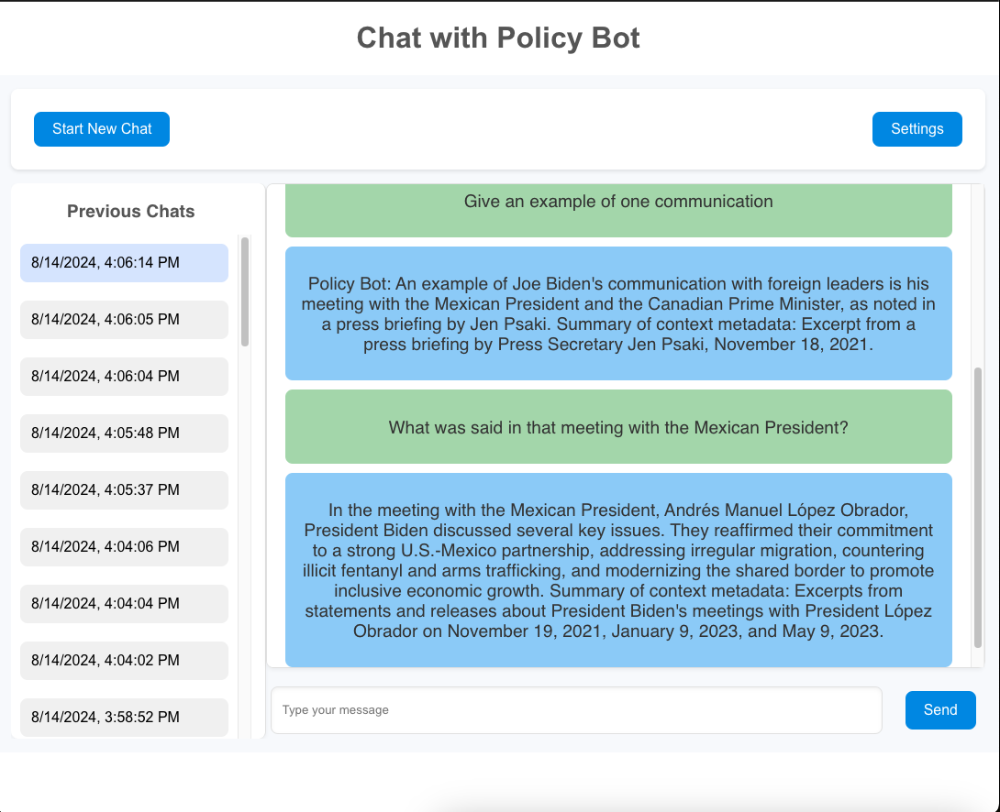

# PolicyBot
### Political LLM App 

To run:
- Start React server in  frontend/ with yarn start, if issues run: rm -rf node_modules --> yarn install --> yarn start
- Start Daphne server in backend/ with daphne -b 0.0.0.0 -p 8000 policybot.asgi:application
- Start redis with redis-server

- To use Django admin: start Django server in backend/ with python manage.py makemigrations --> python manage.py migrate --> python manage.py runserver
- App will run on localhost:3000, Django admin: http://127.0.0.1:8000/admin/

Currently working on:
- Adding structure to LLM response to change frontend for citations of metadata

Future work:
- Testing RAG-Fusion
- Not being able to start a new chat until previous stream is done
- Printing streamed tokens without random spaces
- Start new chat seamlessly instead of double chat

Current look:

## Tech Stack
### In Progress

| Component                | Description                                    |
|--------------------------|------------------------------------------------|
| **Django Backend**       | REST API, User Auth, LLM Integration, RAG System|
| **LangChain & ChatGPT**  | Query Processing, Response Generation          |
| **MongoDB & PostgreSQL** | Document Storage, User Data, Conversation History|
| **React Frontend**       | UI Components, State Management, Chat UI       |

